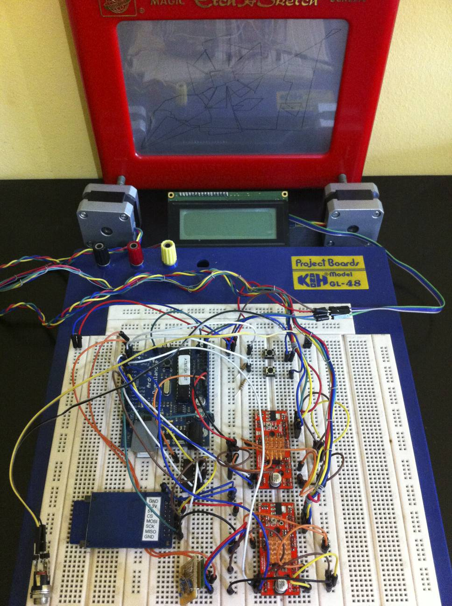

ArduinoPainter
==================
Arduino controller for a generic printing machine.
It's on a early development status.

It's thought to be used with my Android paint tool: http://www.youtube.com/watch?v=dBtlcxkml6k (project repository: https://github.com/santicastro/AndroidGCodePainter)

Some working samples: 

Marker painter:
 - OSHWDem, first device run: https://www.youtube.com/watch?v=ggC-cdSrf58

Etch-a-sketch:
 - Amigus: https://www.youtube.com/watch?v=nvrPPCy2vCk

 - Bricolabs: https://www.youtube.com/watch?v=m7dXjiJnSJo

 - Trileuco: http://www.youtube.com/watch?v=F4bDEykehfI

Previous prototype:

